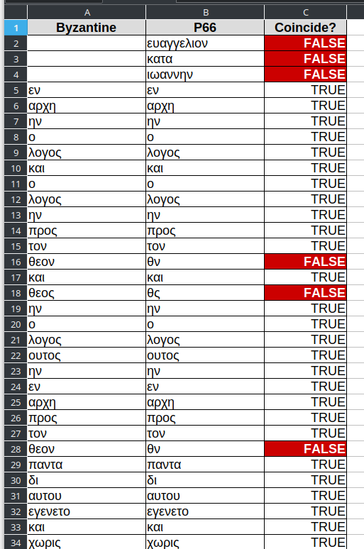

# TEI-XML files of the Byzantine Textform

This folder contains XML files of the entire New Testament (inside the `BYZ` subfolder) and of each book. These files *do not contain accents nor variants*. They represent the main text of the Byzantine Textform.

The files are converted with a script in the `scripts` folder (see there for more details). The source files are in the `source/Strongs` folder.

## Using CollateX

You can download the CollateX software from this URL https://collatex.net/download/
 
Let's suppose you want to compare P66 with the Byzantine text of John 1. You can get the transcription of P66 from the INTF here  https://ntvmr.uni-muenster.de/community/vmr/api/transcript/get/?docID=10066&indexContent=John%201&pageID=ALL&format=teiraw  and the Byzantine text in the present folder.

For this demo, we prepared a TEI file with only the first chapter of the Byzantine John. You can find it [here](assets/demo_john_1.xml) (if you try to run CollateX on the entire book, it will take some time.)

Save the files. For example: `p66.xml` and `demo_john_1.xml`.
 
Then run CollateX with the following command

```bash
java -jar collatex-tools-1.7.1.jar -xp '//w' -xml -f csv -t demo_john_1.xml p66.xml > collation.csv
```

The [resulting file](assets/demo_collation.xlsx) (with a little bit of Excel formatting) looks like this:


